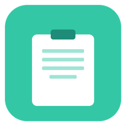

<p align="center">
  
</p>

<h1 align="center">ClipNest</h1>

<p align="center">
  <strong>A lightweight macOS menu bar clipboard manager with snippet support.</strong>
</p>

<p align="center">
  
  
  
</p>

<p align="center">
  <a href="README_ja.md">日本語</a>
</p>

---

## Features

- **Clipboard History** — Automatically tracks your clipboard with configurable history size (10 -- 100 items)
- **Snippets** — Organize frequently used text in nested folders for quick access
- **Global Hotkey** — Trigger ClipNest from anywhere (default: `Cmd+Shift+V`)
- **Auto-Paste** — Selecting an item copies it and pastes into the active app
- **Launch at Login** — Optional auto-start on login
- **Privacy-First** — All data stored locally in `~/Library/Application Support/ClipNest/`

## Screenshots

> *Coming soon*

## Requirements

| Requirement | Version |
|---|---|
| macOS | 13.0 (Ventura) or later |
| Swift | 5.9+ |
| Permissions | Accessibility (prompted on first launch) |

## Install

### Download (recommended)

1. Download `ClipNest.dmg` from the [latest release](https://github.com/nyanko3141592/ClipNest/releases/latest)
2. Open the DMG and drag `ClipNest.app` to `Applications`
3. Since this app is not notarized, macOS may block it. Run in Terminal:
   ```bash
   xattr -cr /Applications/ClipNest.app
   ```
4. Open ClipNest from Applications and grant Accessibility permission when prompted

### Build from source

```bash
git clone https://github.com/nyanko3141592/ClipNest.git
cd ClipNest
bash scripts/build-app.sh
cp -r ClipNest.app /Applications/
```

## Usage

1. ClipNest appears as a paperclip icon in the menu bar.
2. Click the icon or press the global hotkey to open the menu.
3. The **History** submenu shows recent clipboard entries.
4. Top-level items are your snippets — click to paste.
5. Use **Edit Snippets...** to organize snippets into folders.
6. Use **Settings...** to configure hotkey, history size, and launch at login.

## License

[MIT](LICENSE)
